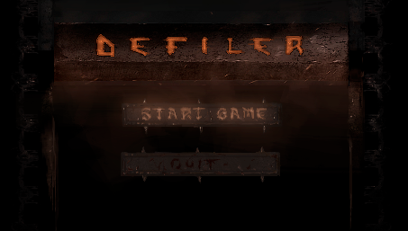
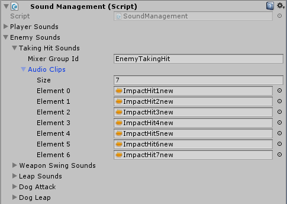
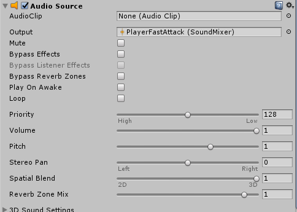
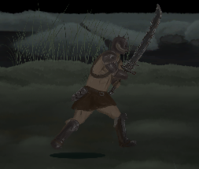
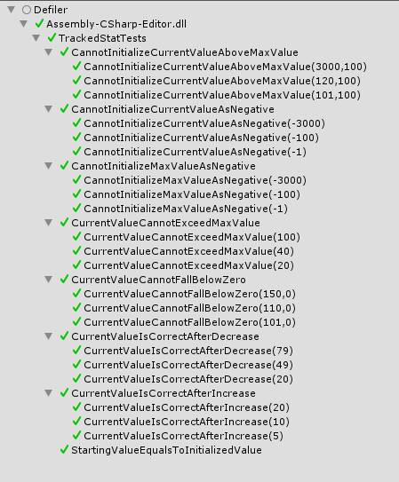

% TiCorporate5 Product Lab Portfolio
% Jarmo Syvälahti
% May 3, 2018

# Preface

This is a portfolio of my works and experiences in our second year's spring semester's TiCorporate5 Product Lab project studies of Business Information Technology in Jyväskylä University of Applied Sciences. The project lasted from January 16th through May 9th, 2018 with three months of actual development. I was part of a game development team "Pakana Games" of six people and my role was one of the three programmers and act as the team's Scrum Master. In this document, I showcase my works and reflect on what I have learned during the project in which we produced a side-scrolling hack 'n' slash game called "Defiler".

# Programming

In the technology side my learning goals for the project were: 

- Modular design in a bigger project
- How to write more readable and maintainable code
- Unit Testing in Unity

In the following chapters, I will cover the main feats I accomplished during the project and sum up what I have learned.

## Game's Managers System

I designed the general game logic and management system. I have a *Managers* Prefab that is utilized in the game's level Scenes. The *Managers* Prefab has *HudManager*, *LevelManager* and *AudioManager* as it's child objects which includes scripts associated with the manager's role. The *HudManager* and the *AudioManager* will be covered in chapters related to them.


The *LevelManager* has the following scripts as it's responsibilities:

- PausingGameManagement
- GameOverManagement
- EnemyManagement
- PlayerPrefsManagement
- ReferenceManagement
- PlayerInputManagement

### PausingGameManagent

*PausingGameManagent* has this method to handle toggling of Paused state when *Pause* button is pressed:

```cs
public void TogglePauseGame()
{
	isPaused = !isPaused;
	GameTimeManagement.ToggleTime(isPaused);
	OnGamePaused(isPaused);
	ToggleActiveScripts(!isPaused);
}
```

### GameOverManagement

*GameOverManagement* handles the activation of Game Over state with the following method when *PlayerDeath* scripts *OnPlayerDeath* event is triggered:

```cs
private void EnterGameOver()
{
	IsGameOver = true;
	OnGameOver();
	GameTimeManagement.ToggleTime(IsGameOver);
}
```

### PlayerPrefsManagement

*PlayerPrefsManagement* handles reading and writing of PlayerPrefs settings which we only ended up using for master volume control. It reads the prefs on *Start()* and Writes them *OnSceneUnloaded()* and *OnApplicationQuit()*.

Here is a snippet of *PlayerPrefsManagemet's* *ReadPlayerPrefs()*:

```cs
private void ReadPlayerPrefs()
{
	const float maxVolume = 1f;

	if (PlayerPrefs.HasKey(globalAudioVolume))
	{
		float volume = PlayerPrefs.GetFloat(globalAudioVolume);
		masterVolumeControl.SetMasterVolume(volume);
	}
	else
	{
		masterVolumeControl.SetMasterVolume(maxVolume);
	}
}
```

### ReferenceManagement

*ReferenceManagement* is a Singleton object, that holds references to commonly referred GameObjects such as the *Player* or *SoundManagement*.

It uses this method to find the GameObjects where I log an error to the console if the object cannot be found:

```cs
private GameObject FindGameObject(string name)
{
	var gameObj = GameObject.Find(name);

	if (gameObj == null)
	{
		Debug.LogError("Cannot find GameObject of name: " + name);
	}

	return gameObj;
}
```

### PlayerInputManagement

Finally *PlayerInputManagement* handles Input for controlling the Player GameObject and it has auto-implemented properties to contain the state of the inputs.

```cs
private void Update()
{
	Horizontal = Input.GetAxis("Horizontal");
	Vertical = Input.GetAxis("Vertical");
	HorizontalRaw = Input.GetAxisRaw("Horizontal");
	VerticalRaw = Input.GetAxisRaw("Vertical");
	IsAxisInput = (HorizontalRaw != 0 || VerticalRaw != 0) ? true : false;
	FastAttack = Input.GetButtonDown("FastAttack");
	StrongAttack = Input.GetButtonDown("StrongAttack");
	Block = Input.GetButton("Block");
	Dodge = Input.GetButton("Dodge");
}
```

## HUD & Menu Logic

I designed implemented almost all of the heads-up display and menu logic. I tried to separate the display of data from the rest of the game logic. My Hud related objects know about the *Player* and the *GameManager*, but they only offer the required events that the Hud logic needs to subscribe to.

*Managers* Prefab's child *HudManager* has the following scripts attatched:

- PlayerHealthBarHud
- PlayerStaminaBarHud
- PauseMenuHud
- GameOverHud
- SceneChangeFadeEffect
- ControlMenuHud

In our game, we have a quite minimalistic HUD, but we have Player's Health and Stamina Bar visible.


### PlayerHealthBarHud

*PlayerHealthBarHud* script gets *Player's* maximum and starting health and subscibes to *PlayerHealth's* *OnHeathChange* event.

This is the method that is called *OnHealthChange()*:

```cs
private void UpdateHealthBar()
{
	playerHealthBarSlider.value = playerHealth.CurrentHealth;
	StartCoroutine(HudEffects.FadeEffect(healthBarFillImage, fadeEffectTargetFade, fadeEffectRate, initialFade));
}
```

### PlayerStaminaBarHud

*PlayerStaminaBarHud* script is similar although it has more events it needs to subscribe to which are *OnStaminaChange*, *OnDecreaseStamina* and *OnNotEnoughStamina*.

These are the methods that are called on those events:

```cs
private void UpdateStaminaBar()
{
	playerStaminaBarSlider.value = playerStamina.CurrentStamina;
}

private void CallStaminaBarFadeEffect()
{
	StartCoroutine(HudEffects.FadeEffect(staminaBarFillImage, staminaBarFillFadeEffectTargetFade, staminaBarFillFadeEffectRate, staminaBarFillInitialFade));
}

private void CallNotEnoughStaminaFadeEffect()
{
	StartCoroutine(HudEffects.InverseFadeEffect(notEnoughStaminaImage, notEnoughStaminaFadeEffectTargetFade, notEnoughStaminaFadeEffectRate, notEnoughStaminaInitialFade));
}
```

### HudEffects

The effect Coroutines I have in my previously mentioned scripts are located in static *HudEffects* class.

Here is an example of one of the effect functions:

```cs
public static IEnumerator FadeOutEffect(Image image, float startingFade, float fadeEffectRate, float targetFade)
{
	var color = image.color;
	color.a = startingFade;
	image.color = color;

	while (color.a >= targetFade)
	{
		color.a -= fadeEffectRate * Time.deltaTime;
		image.color = color;
		yield return null;
	}
}
```

For example, the Stamina Bar background flashes red when Player doesn't have enough Stamina to activate certain actions:


### PauseMenuHud

*PauseMenuHud* script toggles The Pause Menu on and off based on *PausingGameManagements* event and handles the actions of button events.


Here are the events PauseMenuHud subscribes to:
```cs
	continueButton.onClick.AddListener(ContinueClick);
	restartButton.onClick.AddListener(RestartClick);
	returnToMainMenuButton.onClick.AddListener(ReturnToMainMenuClick);
	controlsButton.onClick.AddListener(ToggleControlsMenu);

	pausingGameManagement.OnGamePaused += ToggleGamePausedPanel;

	audioVolumeSlider.onValueChanged.AddListener(delegate { AudioVolumeChange(); });

	audioVolumeSlider.value = masterVolumeControl.GetMasterVolume();
```

Here are examples of the methods that are triggered by the events:
```cs
private void ToggleGamePausedPanel(bool isActive)
{
	gamePausedPanel.SetActive(isActive);
}

private void ContinueClick()
{
	pausingGameManagement.TogglePauseGame();
}

private void RestartClick()
{
	SceneLoader.RestartScene();
}
```

### GameOverHud

The *GameOverHud* is similar to *PauseMenuHud* but is more simple.


### Main Menu

For the Main Menu, we have a bit quirky solution of *Start Game* Button state changing the whole menu graphic, so I can't use the normal Button functionality that Unity provides.



This is the *MainMenuControllers* function that is triggered *OnMenuButton* event of *MenuButtonEvents* script:
```cs
private void ChangeMainMenuGraphic(int state)
{
	switch (state)
	{
		case (int)ButtonEventsEnum.Enter:
			mainMenuImage.sprite = mainMenuGraphicsStates[(int)MenuGraphicStates.Hover];
			audioSources[(int)MenuButtonSounds.Move].Play();
			break;
		case (int)ButtonEventsEnum.Exit:
			mainMenuImage.sprite = mainMenuGraphicsStates[(int)MenuGraphicStates.Default];
			audioSources[(int)MenuButtonSounds.Move].Play();
			break;
		case (int)ButtonEventsEnum.Down:
			mainMenuImage.sprite = mainMenuGraphicsStates[(int)MenuGraphicStates.Pressed];
			break;
	}
}
```

This is the number of Interfaces I had to implement in MenuButtonEvents to get the functionality that is required:

```cs
public class MenuButtonEvents : MonoBehaviour, IPointerEnterHandler, IPointerExitHandler, IPointerDownHandler, ISelectHandler, IDeselectHandler
```

### Story Screens

We have Story Screens between Level Scenes in our game. I designed the logic and functionality of the Story Screens as well. 


The Story Screens are like a slide show that has transition effects. Each screen resides in its own panel in the Story Screen's Canvas. This is the function that handles changing the screen that is called on *AnyKeyDown*:

```cs
private IEnumerator showNextFrame()
{
	var picture = GetPictureImage();
	var text = GetTextImage();

	yield return StartCoroutine(HudEffects.FadeOutEffect(picture, visible, pictureFadeRate, invisible));

	framePanels[currentFrame].SetActive(false);

	currentFrame++;

	if (currentFrame < framePanels.Length)
	{
		picture = GetPictureImage();
		text = GetTextImage();

		text.gameObject.SetActive(false);

		framePanels[currentFrame].SetActive(true);

		yield return StartCoroutine(HudEffects.FadeInEffect(picture, invisible, pictureFadeRate, visible));

		text.gameObject.SetActive(true);

		yield return StartCoroutine(HudEffects.FadeInEffect(text, invisible, textFadeRate, visible));
	}
	else
	{
		SceneLoader.LoadNextScene();
	}
}
```

## Audio System & Audio Implementation

I designed a Unity's Audio Mixer based audio solution for our game that supports positional audio and I also implemented all the audio in our game.

I have a *MasterMixer* asset, that is routed to *Main Camera's* Audio Listener. *MusicMixer* and *SoundMixer* are routed to *MasterMixer*.


### SoundManagement

Scene's *AudioManager* GameObject has *Sound Management* script that handles playback of audio files and holds references to Audio Clip assets.



*SoundManagement* script has fields for different categories of sounds and a method to play a random variation of a sound from an array of sounds by type eg. *PlayerSounds.FastAttackSounds*.

*SoundManagement's* fields for the category of sounds:

```cs
[SerializeField]
private PlayerSounds playerSounds;
[SerializeField]
private EnemySounds enemySounds;
[SerializeField]
private LevelSounds levelSounds;
```

*SoundManagement's* method to play sound:
```cs
public void PlaySound(AudioClipsContainer clips, GameObject objectWithAudioSourceToPlay)
{
	var source = objectWithAudioSourceToPlay.GetComponentInChildren<ObjectsAudioSources>()
		.AudioSources[clips.MixerGroupId];
	source.clip = ReturnRandomAudioClip(clips.AudioClips);
	source.Play();
}
```

*SoundManagement's* method to return random clip from audio clips array:
```cs
private AudioClip ReturnRandomAudioClip(params AudioClip[] clips)
{
	//Generate a random number between 0 and the length of our array of clips passed in.
	int randomIndex = Random.Range(0, clips.Length);

	return clips[randomIndex];
}
```

### Audio Category classes

I have serializable classes for audio categories, this is an example of *PlayerSounds* class:

```cs
[Serializable]
public class PlayerSounds
{
    [SerializeField]
    private AudioClipsContainer fastAttackSounds;
    [SerializeField]
    private AudioClipsContainer strongAttackSounds;
	
	...
	
	// read-only properties for the fields...
}
```

### AudioClipsContainer

The serializable AudioClipsContainer class holds an id for Mixer Group that the Sound Clip is supposed to be routed to and an array of Audio Clips for variations of the certain type of sound effect:

```cs
[Serializable]
public class AudioClipsContainer 
{
	[Tooltip("Name of the accociated mixer group for the clips")]
	[SerializeField]
	private string mixerGroupId;
	[SerializeField]
	private AudioClip[] audioClips = new AudioClip[0];
	
	// read-only properties for the fields...
}
```

### ObjectsAudioSources

The GameObjects that have sound effects associated with them hold *AudioSources* GameObject as a child object. In that object, I have Audio Source components attached to it for each sound type and they are routed to output to correct SoundMixer's mixer group. For the Level Scenes, sound effects have their spatial blend set to 3D in order to have the sound effects some positional audio feeling.



The *AudioSources* GameObject also has a *ObjectsAudioSources* script attached that has a Dictionary to refer the object's Audio Sources. The keys were automatically created from the Audio Sources' *outputAudioMixerGroup* property.  This way I could play the correct Audio Clip by the correct Audio Source by coupling them with the Mixer Group's name as the identifier.

This is the loop that runs in the *ObjectsAudioSources* script to add the Dictionary's keys and values:

```cs
private void Start()
{
	foreach(var audioSource in GetComponents<AudioSource>())
	{
		var key = audioSource.outputAudioMixerGroup.ToString();
		// Remove " (UnityEngine.AudioMixerGroup)" from key in build version.
		if (key.Contains(" "))
		{
			key = key.Substring(0, key.IndexOf(' '));
		}
		audioSources.Add(key, audioSource);
	}
}
```

### Conclusion

In the end, I maybe could have simplified the system somewhat by having the actor GameObject to also hold references to its Audio Clips and handle the activation of the sound by itself.

## Refactoring of Player's Actions & State Machine

I refactored most of the *Player's* logic and all of it's State Machine code to remove input handling from actions related scripts, to improve modularity and readability, to make the code easier to modify and expand and to remove duplication. Next, I will cover some examples of the code I rewrote.

### PlayerIdleState

This is an example of *PlayerIdleState's* *UpdateState* method. It is one of the larger states along with *PlayerMoveState*. *Player's* State Machine calls actions from action related scripts and changes state based on changes in *Player's* actions:

```cs
public override void UpdateState(PlayerFSM owner)
{
	if (owner.PlayerDeath.IsDead)
	{
		owner.Fsm.ChangeState(new PlayerDeadState());
	}
	else if (owner.PlayerStagger.IsStaggered)
	{
		owner.Fsm.ChangeState(new PlayerStaggerState());
	}
	else if (owner.PlayerInput.FastAttack
		&& owner.PlayerStamina.ConsumeStamina(owner.PlayerStats.FastAttackStaminaCost))
	{
		owner.Fsm.ChangeState(new PlayerFastAttackState());
	}
	else if (owner.PlayerInput.StrongAttack
		&& owner.PlayerStamina.ConsumeStamina(owner.PlayerStats.StrongAttackStaminaCost))
	{
		owner.Fsm.ChangeState(new PlayerStrongAttackState());
	}
	else if (owner.PlayerInput.Block && !owner.PlayerBlock.IsBlockOnCooldown
		&& owner.PlayerStamina.ConsumeStamina(owner.PlayerStats.ActivateBlockStaminaCost))
	{
		owner.Fsm.ChangeState(new PlayerBlockState());
	}
	else if (owner.PlayerInput.Dodge
		&& owner.PlayerInput.IsAxisInput
		&& owner.PlayerStamina.ConsumeStamina(owner.PlayerStats.DodgeStaminaCost))
	{
		owner.Fsm.ChangeState(new PlayerDodgeState());
	}
	else if (owner.PlayerInput.IsAxisInput)
	{
		owner.Fsm.ChangeState(new PlayerWalkState());
	}
}
```

### PlayerMovement

*PlayerMovement* script's Move() moves Player via ChacterController and updates *Player's* direction of facing:

```cs
public void Move(float inputX, float inputY)
{
	Vector3 movementDirection = new Vector3(inputX, 0, inputY).normalized;
	float movementSpeed = playerStats.DefaultWalkSpeed;

	characterController.Move(movementDirection * movementSpeed * Time.deltaTime);

	SetFacing(inputX);

	animator.SetBool("isWalking", true);
}
```

*PlayerMovement's* *SetFacing()* flips the sprite, shadow and attack hiboxes position:

```cs
private void SetFacing(float inputX)
{
	bool hasFacingChanged =
		((!isFacingRight && inputX > 0)
		||
		(isFacingRight && inputX < 0));

	if (hasFacingChanged)
	{
		isFacingRight = !isFacingRight;
		spriteRenderer.flipX = isFacingRight;
		playerAttackHitboxes.FlipAttackHitBoxesTowardsFacing();
		shadow.SetShadowPosition(IsFacingRight);
	}
}
```

### PlayerAttack

*PlayerAttack* script's *FastAttack()* activates the correct Fast Attack animation based on *ComboState*:

```cs
public void FastAttack()
{
	float animationLength = GetComboAttackLength();

	animator.SetBool("isFastAttack", true);
	animator.SetInteger("comboState", (int)comboState);

	StartCoroutine(ToggleIsAttackingAfterTime(animationLength));
	SetComboState();
}
```

This method sets the *ComboState* that determines which attack is executed when player presses *FastAttack* Button:

```cs
private void SetComboState()
{
	switch (comboState)
	{
		case ComboStates.FastAttack:
			resetComboStateRoutine = StartCoroutine(ResetComboStateAfterTime());
			comboState++;
			break;

		case ComboStates.ComboAttack1:
			comboState++;
			break;

		case ComboStates.ComboAttack2:
			StopCoroutine(resetComboStateRoutine);
			comboState = ComboStates.FastAttack;
			break;
	}
}
```

### PlayerAttackHitboxes

*PlayerAttackHitboxes* script handles the references to attack hitboxes, triggering them from attack animations, deactivating them after a short time and flipping them based on facing.

This method gets the references:
```cs
private void GetReferenceToAttackHitboxes()
{
	int amountOfAttackHitboxes = Enum.GetNames(typeof(PlayerAttack.PlayerAttackTypes)).Length;

	attackHitboxes = new GameObject[amountOfAttackHitboxes];

	for (int i = 0; i < amountOfAttackHitboxes; i++)
	{
		attackHitboxes[i] = gameObject.transform.GetChild(i).gameObject;
	}
}
```

This method flips the attack hitboxes towards facing:
```cs
public void FlipAttackHitBoxesTowardsFacing()
{
	const float changeSign = -1;

	foreach (var hitbox in attackHitboxes)
	{
		var pos = hitbox.transform.localPosition;

		hitbox.transform.localPosition = new Vector3(pos.x * changeSign, pos.y, pos.z);
	}
}
```

## Refactoring of Hit Detection System

I refactored the Player's and enemies' hitting and getting hit mechanics. Before the refactoring the logic was spread out to different places, Player's getting hit logic was handled in Enemy's code and vice versa. I centralized the decision making and redid the sharing of responsibility.

### PlayerTakingHit

*PlayerTakingHit* script handles hits that an enemy registers on *Player*. *EnemyWeaponHitDetection* script calls this method from *PlayerTakingHit*:

```cs
public void TakeHit(float hitterPositionX, int damage, float damageReductionModifier, out bool isTimedBlocked)
{
	const int damageWhenTimedBlocked = 0;

	var playerBlock = GetComponent<PlayerBlock>();
	var playerDodge = GetComponent<PlayerDodge>();
	bool isFrontalStrike = CheckIsFrontalStrike(hitterPositionX);
	int damageDealt = damage;

	isTimedBlocked = false;

	if (isTakeHitDisabled || playerDodge.IsInvulnerable)
	{
		return;
	}

	if (playerBlock.IsBlockingActive && isFrontalStrike)
	{
		if (playerBlock.IsTimedBlockActive)
		{
			damageDealt = damageWhenTimedBlocked;
			isTimedBlocked = true;
		}
		else
		{
			damageDealt = (int)(damage * damageReductionModifier);
			GetComponent<PlayerStamina>().DecreaseStamina(GetComponent<PlayerStats>().BlockAttackStaminaCost);
		}

		GetComponent<SparkEffect>().Spark();
		soundManagement.PlaySound(soundManagement.PlayerSounds.BlockParrySound, gameObject);
	}

	if (damageDealt > 0)
	{
		particle.Play();
		GetComponent<PlayerHealth>().DecreaseHealth(damageDealt);
		GetComponent<PlayerStagger>().PlayerTakesHit();
		soundManagement.PlaySound(soundManagement.PlayerSounds.TakingHitSounds, gameObject);
	}
}
```

This is the method that checks whether a hit comes from front or back:

```cs
private bool CheckIsFrontalStrike(float opponentPositionX)
{
	bool playerIsFacingRight = GetComponent<PlayerMovement>().IsFacingRight;
	float playerPositionX = gameObject.transform.position.x;

	return playerPositionX < opponentPositionX
		&& playerIsFacingRight
		|| playerPositionX > opponentPositionX
		&& !playerIsFacingRight;
}
```

### EnemyWeaponHitDetection

*EnemyWeaponHitDetection* script that is attatched to enemy's weapon hitbox detects hit on *Player* and calls *PlayerTakingHit's* *TakeHit()*:

```cs
private void OnTriggerEnter(Collider other)
{
	if (other.CompareTag("Player"))
	{
		bool isEnemyBlockedWithTimedBlock;
		var playerTakingHit = other.GetComponent<PlayerTakingHit>();

		playerTakingHit.TakeHit(
			enemy.transform.position.x,
			attackDamageTypes[(int)attackDamageType],
			enemyStats.DamageReductionModifier,
			out isEnemyBlockedWithTimedBlock);

		if (isEnemyBlockedWithTimedBlock)
		{
			enemy.GetComponent<EnemyStun>().Stun(true);
		}
	}
}
```

### PlayerWeaponhitDetection

For *Player's* *PlayerWeaponhitDetection* I serialized *PlayerAttack.PlayerAttackTypes* enum field to show in inspector. This way I can use the same script for each of the *Player's* attack hitbox GameObjects to get the correct damage amount.

```cs
    [SerializeField]
    private PlayerAttack.PlayerAttackTypes attackType;
```

*PlayerWeaponHitDetection* detects hits on enemies and destroyable barriers:

```cs
private void OnTriggerEnter(Collider coll)
{
	bool isEnemy = coll.CompareTag("Enemy");
	bool isBarrier = coll.CompareTag("Barrier");

	if (isEnemy || isBarrier)
	{
		int attackDamage = GetAttackDamage();

		if (isEnemy)
		{
			var enemyTakingHit = coll.GetComponent<EnemyTakingHit>();
			bool isStrongAttack = (attackType == PlayerAttack.PlayerAttackTypes.StrongAttack);
			float playerX = transform.parent.position.x;

			enemyTakingHit.TakeHit(attackDamage, isStrongAttack, playerX);
		}

		if (isBarrier)
		{
			var barrier = coll.GetComponent<Barrier>();

			barrier.TakeHit(attackDamage);
		}
	}
}
```

*PlayerWeaponHitDetection's* *GetAttackDamage()* returns the dealt damage amount based on the attack type:

```cs
private int GetAttackDamage()
{
	int damage = 0;

	switch (attackType)
	{
		case PlayerAttack.PlayerAttackTypes.FastAttack:
			damage = playerStats.FastAttackPower;
			break;
		case PlayerAttack.PlayerAttackTypes.ComboAttack1:
			damage = playerStats.ComboAttack1Power;
			break;
		case PlayerAttack.PlayerAttackTypes.ComboAttack2:
			damage = playerStats.ComboAttack2Power;
			break;
		case PlayerAttack.PlayerAttackTypes.StrongAttack:
			damage = playerStats.StrongAttackPower;
			break;
	}

	return damage;
}
```

## Player's Dodge Feature

I designed and implemented *Player's* *Dodge* feature. A player can execute a dodge movement in any direction by pressing both *Dodge* Button and giving directional input which moves the *Player* in that direction with given speed for the length of the animation. The movement is triggered inside dodge animation. The *Player* is invulnerable during the dodge movement period which gives player better survivability against enemy attacks.



In *PlayerDodge* script there are methods for horizontal and vertical dodge movement. Which one is called is decided in *PlayerDodgeState*. 

### PlayerDodgeState

This is *PlayerDodgeState's* *EnterState*:

```cs
public override void EnterState(PlayerFSM owner)
{
	float horizontalDirection = owner.PlayerInput.HorizontalRaw;
	float verticalDirection = owner.PlayerInput.VerticalRaw;

	if (horizontalDirection != 0)
	{
		owner.PlayerDodge.DodgeHorizontal(horizontalDirection, verticalDirection);
	}
	else
	{
		owner.PlayerDodge.DodgeVertical(verticalDirection);
	}
}
```

### PlayerDodge

Here is an example of *PlayerDodge* script's *DodgeHorizontal()*:

```cs
public void DodgeHorizontal(float horizontalDirection, float verticalDirection)
{
	dodgeDirection = new Vector3(horizontalDirection, 0, verticalDirection).normalized;
	bool isDodgingForward = (playerMovement.IsFacingRight && horizontalDirection > 0)
		|| (!playerMovement.IsFacingRight && horizontalDirection < 0);
	float animationLength;

	if (isDodgingForward)
	{
		animator.SetTrigger("triggerDodgeForward");
		animationLength = dodgeAnimations[(int)DodgeAnimations.Forward].length;
	}
	else
	{
		animator.SetTrigger("triggerDodgeBackward");
		animationLength = dodgeAnimations[(int)DodgeAnimations.Backward].length;
	}

	StartCoroutine(ToggleIsDodgeActiveAfterTime(animationLength));
}
```

This Coroutine moves the *Player* during the animation. It is activated from animation:

```cs
private IEnumerator DodgeMove()
{
	StartCoroutine(ToggleInvulnerabilityAfterTime());

	while (IsDodgeActive)
	{
		characterController.Move(dodgeDirection * playerStats.DodgeSpeed * Time.deltaTime);
		yield return null;
	}
}
```

## Player's Stamina System

I designed and implemented *Player's* *Stamina* system. *Player's* attacks, dodge and blocking attacks consume stamina which regenerates at certain rate except when *Player* is blocking.

### PlayerStamina

*PlayerStamina* script's *ConsumeStamina()* is used in *Player's* State Machine state change checks. It returns if the *Player* has enough stamina to use the action and decreases *Player's* stamina by the cost if the *Player* has enough stamina.

```cs
public bool ConsumeStamina(int staminaCost)
{
	bool hasEnoughStamina = staminaCost <= stamina.CurrentValue;

	if (hasEnoughStamina)
	{
		DecreaseStamina(staminaCost);
	}
	else
	{
		soundManagement.PlaySound(soundManagement.PlayerSounds.NotEnoughStaminaVoice, gameObject);
		OnNotEnoughStamina();
	}

	return hasEnoughStamina;
}
```

The stamina regens at certain intervals. If stamina regen is active, *RegenStamina()* is called in *Update()*:

```cs
private void Update()
{
	if(isStaminaRegenActive)
	{
		RegenStamina();
	}
}

private void RegenStamina()
{
	timer += Time.deltaTime;

	if (timer > regenStaminaInterval)
	{
		timer -= regenStaminaInterval;
		IncreaseStamina((int)(staminaGainPerSecond * regenStaminaInterval));
	}
}
```

## Unit Testing

I wrote a small *TrackedStat* class that I use in *Health* and *PlayerStamina* scripts to store the maximum and current values of those stats. I practiced Unit Testing with Unity by writing tests for the *TrackedStat* class by using the NUnit test framework.

### TrackedStat

Here are the Constructor(), *IncreaseValue()* and *DecreaseValue()* of that class:

```cs
public TrackedStat(int startingValue, int startingMaxValue)
{
	currentValue = Mathf.Clamp(startingValue, 0, startingMaxValue);
	maxValue = (startingMaxValue >= 0) ? startingMaxValue : 0;
}

public void IncreaseValue(int amount)
{
	currentValue += (currentValue + amount <= maxValue) ?
		amount : maxValue - currentValue;
}

public void DecreaseValue(int amount)
{
	currentValue -= (currentValue - amount >= 0) ?
		amount : Mathf.Abs(0 - currentValue);
}
```

### TrackedStatTests

Here are the test results from running the *TrackedStatTests* from Unity's Test Runner:



Here is the setup and couple of the test cases:

```cs
[SetUp]
public void SetUp()
{
	trackedStat = new TrackedStat(startingValue, maxValue);
}

[TestCase(101, 0)]
[TestCase(110, 0)]
[TestCase(150, 0)]
public void CurrentValueCannotFallBelowZero(int decreaseAmount, int expectedValue)
{
	trackedStat.DecreaseValue(decreaseAmount);

	Assert.That(trackedStat.CurrentValue, Is.EqualTo(expectedValue));
}

[TestCase(101, 100)]
[TestCase(120, 100)]
[TestCase(3000, 100)]
public void CannotInitializeCurrentValueAboveMaxValue(int startingValue, int maxValue)
{
	trackedStat = new TrackedStat(startingValue, maxValue);
	int expected = maxValue;
	Assert.That(trackedStat.CurrentValue, Is.EqualTo(expected));
}
```

### Afterthought

I think we should have covered more of our logic and math code with unit tests, but I found it difficult to test Monobehaviours that were dependant on other Monobehaviours. This perhaps was a sign of design flaws in our system.

## Learning Outcomes

My learning outcomes considering programming were:

- I learned to solve many typical game programming problems and implement common games related systems.
- My code reading speed increased by going through tens of merge requests. 
- My code production speed increased by writing quite a bit of production code.
- The quality of the code I produced got better after reviewing and refactoring a lot of code and discussing it with my team's programmers.
- My debugging skills got better by debugging many problems and going through bug reports. 
- I learned the basics of using Unit Tests and NUnit framework.

# Scrum Master

As the team's Scrum Master I set myself the following learning goals:

- To get more confidence acting in the SM role
- To put to use the skills I learned about project management in a previous project
- To try to find the best practices suitable for our team

## Ceremonies and Artifacts

We selected the  Scrum as our agile project management framework because we were already familiar with it based on our previous project. I was in charge of the process and facilitated the following Scrum Ceremonies and Artifacts

### Project Plan

In Co-operation with my team, I laid out a plan how the management of the project was going to be handled and how we were going to operate following the Scrum. I also updated the plan when it was necessary.

### Product Backlog

In collaboration with the team's Product Owner, we maintained the project's Product Backlog in *Open Project* project management software. We had User Stories that were prioritized in order of importance and relevance to the current scope. Anyone in the team could add new User Stories, but it was finally the Product Owner's responsibility to decide what were the top priorities. In practice we usually updated our Product Backlog when the current Sprint was ending and during Planning Days.

### Planning Days

I facilitated our Planning Days. Our Sprints were two weeks of length so that was our timeframe to plan things ahead in detail. Overall we succeeded decently at planning our Sprints. 

However, the trend was in the side that we had a bit too much to do per Sprint than what was realistic without doing overtime. Another problem was that I could not keep the team motivated to participate in the planning actively enough. This ended up in the situation that the planning sessions were a bit restless and people were working on their computers at the same time.

On the positive side though we did manage to identify the tasks that were included in each of the Stories quite successfully and also our Sprints pretty much followed the plan we laid out during Planning Days.

### Sprint Backlog

First, our plan was to keep our Sprint Backlog also in the *Open Project* software so we could make tasks in there, estimate Story Points for the User Stories, keep track of hour estimates and consumed hours for the Tasks and get a Burndown Chart out of the software. We tried this in our first two Sprints. And it didn't work as well as I hoped.

Problem was that no one of the team paid much attention to it because the software was somewhat clumsy to use, so our Sprint Backlog didn't keep up to date. It was also difficult for me to get a sense of the whole picture out of it and the Burndown Chart wasn't what I wanted it to be. So the conclusion was that it didn't serve our purpose.

In the third Sprint, we abandoned it all altogether as our Sprint Backlog platform and moved in a more traditional solution that was a flip chart, marker pen, and Post-it Notes. It ended up working great. We could see the whole picture all the time and people were active to move the Tasks from Todo state to Doing and Done states.


During the planning of our second Sprint, the team wanted to try to give up on the Tasks hour estimates. I agreed that we could try it. It turned out working fine and in the consequence of that we ended up paying more attention to the Story Point estimates. We used a scale of working days per Story where one point was equal to one person's day of work. This kept the estimates accurate enough without frustrating the team too much.

### Daily Scrums

I held short daily meetings during mornings when everyone had arrived to work. During those meetings, everyone could tell others what they had done the previous day and what they would do next. Also if we had any issues blocking our progress we could share them. The Daily Scrums helped keep the whole team on track and aware of the current progress. If any of the team members were working remotely they would share the same things in our Slack channel.

### Sprint Demos

We had Sprint Demos every other Sprint officially for all the game development teams together where we presented our accomplishment to others and to the Evaluation Group. The other times our Demos consisted of the team and anyone interested playing our current build and summing up what we had achieved compared to the Sprint Goal.

### Retrospectives

In the end of every Sprint, I hosted a Retrospective meeting for our team. I tried to create a relaxed situation where everyone could share their opinion of what conventions and activities we have that work and support our progress and in what part we could improve our procedures.

In every Retrospective, we managed to identify some issues and also some things that were doing well. I was glad that we could also improve in the following Sprints on some of the issues.

One problem we had during our first Retrospectives was that some team members didn't express their opinion very clearly. I tried to think of the way I could encourage them to share their thoughts and ended up asking them to first write down in Post-it Notes at least one thing of each category. This practice ended up working well for us and people participated more actively in bringing up their opinions.

## Learning Outcomes

My learning outcomes considering the Scrum process and acting as the project's Scrum Master were:

- I learned that it is more effective to motivate team members with carrots than with sticks. 
- I learned to adhere to the agile principle of improving and adapting the process constantly and making even big changes to the conventions if it benefits the team and improves the team's capability to produce better results.
- Scrum Master's role is certainly not easy but the process of learning it is rewarding.